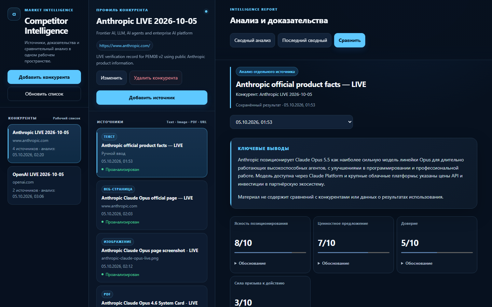
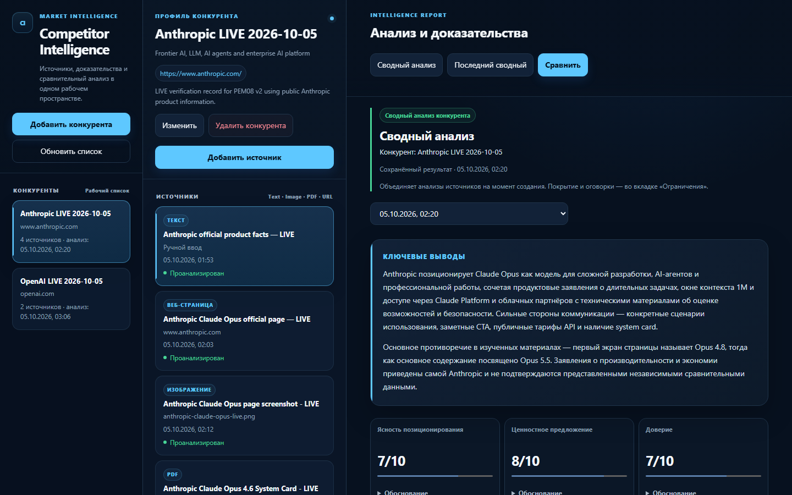
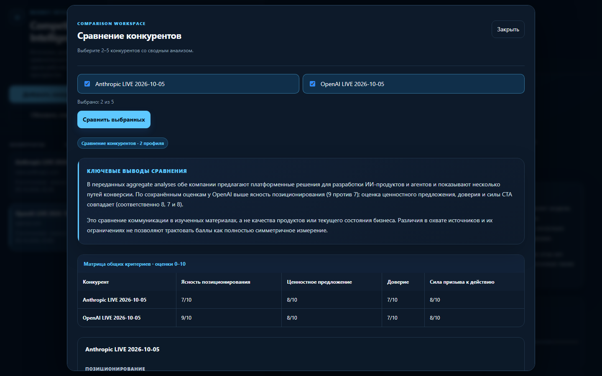
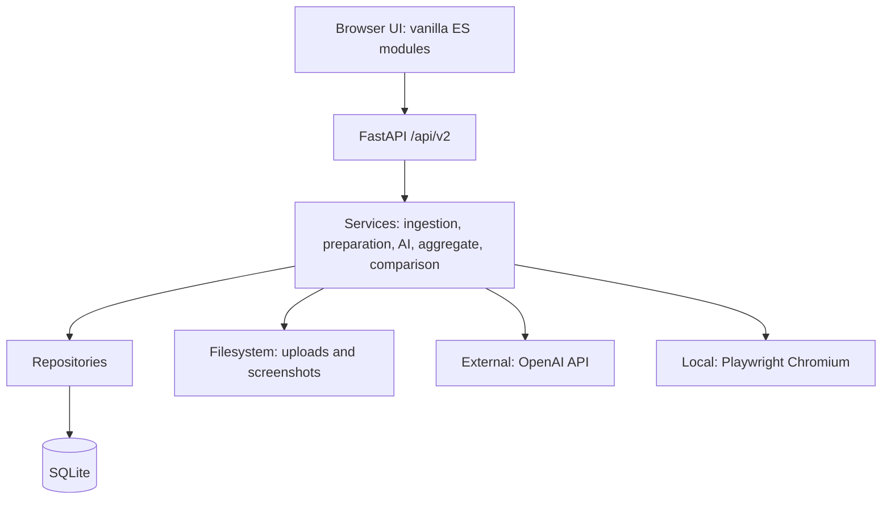

# Competitor Intelligence Assistant — PEM08 v2

Локальное Web-приложение для сбора источников о конкурентах, доказательного AI-анализа, построения сводного профиля и сравнения компаний.

## О проекте / Case

Аналитику или маркетологу приходится собирать сведения о конкурентах из разных источников и вручную сводить их в единый анализ. PEM08 объединяет эту работу в одном пространстве: принимает текст, изображения, PDF и публичные URL, сохраняет исходные материалы и структурированные результаты, формирует профиль конкурента и сравнивает 2–5 компаний.

Выводы относятся к представленным материалам и их коммуникации. Оценки модели не являются объективным измерением качества бизнеса, продукта или инвестиционной привлекательности. Для проверки результатов доступны evidence, происхождение данных и limitations.

## Основной workflow

```text
Competitor
   ↓
Text / Image / PDF / URL
   ↓
Source Snapshot
   ↓
Structured AI Analysis
   ↓
Aggregate Competitor Profile
   ↓
2–5 Competitor Comparison
```

При создании конкурента поле «Первый источник (необязательно)» принимает URL http(s) или текст: после сохранения карточки источник автоматически добавляется и анализируется через обычный ingestion workflow. Введённый URL также сохраняется как сайт профиля; повторный ввод не нужен. Пустое поле создаёт только карточку. Дополнительные Text, URL, PDF и Image по-прежнему добавляются кнопкой «Добавить источник». Если обработка первого источника завершилась ошибкой, карточка остаётся активной, данные сохраняются в форме; повтор использует уже сохранённый источник, если он появился. При неизвестном результате сетевого запроса повторная отправка блокируется до проверки сохранённого результата.

Добавление источника запускает его AI-анализ. «Повторить анализ» использует сохранённый snapshot; «Обновить страницу» повторно загружает URL и создаёт новый snapshot. «Проанализировать конкурента» создаёт новый сводный анализ и может вызвать AI. «Открыть последний анализ» открывает сохранённый сводный результат без AI-запроса. «Сравнить конкурентов» открывает выбор 2–5 конкурентов; новое сравнение выполняется только кнопкой «Сравнить выбранных».

## Скриншоты

**Desktop workspace и анализ отдельного источника.** Список конкурентов, источники и отчёт с доказательствами находятся в трёх панелях.



**Сводный анализ конкурента.** Режим и контекст обозначены над отчётом; подробности и обоснования оценок доступны отдельно.



**Сравнение конкурентов.** Общие критерии, ключевые выводы и ограничения помогают сопоставить профили.



Изображения получены при Stage 11 review сохранённых результатов по публичным материалам Anthropic и OpenAI. Это иллюстрация интерфейса и AI-интерпретаций, а не актуальный справочник о компаниях. Рабочая DB и исходные runtime-файлы в репозиторий не включены.

## Реализованные функции

- CRUD карточек конкурентов: название, сайт, ниша и заметки.
- Text, JPEG/PNG/WebP Image, PDF и URL sources; Chromium capture публичных веб-страниц.
- Сохранённые snapshots, source analysis, reanalysis, URL refresh и история анализов.
- Aggregate competitor analysis по последним анализам текущих snapshots; comparison 2–5 конкурентов с сохранёнными aggregate-профилями.
- Executive summary, scorecard с rationale, evidence, рекомендации и ограничения; сохранение input/output token usage, когда их возвращает провайдер.
- Responsive Web UI для desktop/tablet/mobile, безопасный plain-text DOM rendering, обработка ошибок, loading и конкурентных запросов.
- Локальная SQLite persistence и контролируемые файловые артефакты; данные сохраняются после перезапуска.

## Architecture



**Source** — зарегистрированный материал конкурента. **Snapshot** — сохранённая версия его содержимого и метаданных. **Analysis** — структурированный AI-результат для snapshot или сводный результат конкурента. Обновление URL создаёт новую версию; повторный анализ сохраняет новый результат без повторного capture.

Подробнее: [Architecture](docs/ARCHITECTURE.md) и [API quick reference](docs.md).

## Technology stack

Python · FastAPI/Uvicorn · SQLAlchemy/SQLite · Pydantic · OpenAI Python SDK / AsyncOpenAI · Playwright/Chromium · PyMuPDF · Pillow · vanilla JavaScript ES modules · HTML/CSS · pytest/pytest-asyncio.

Frontend не требует Node или build pipeline. Node используется только для необязательной проверки JS syntax.

## Quick Start — Windows / PowerShell

Проверенная версия: **Python 3.14**. Прямые зависимости закреплены в `requirements.txt`; другие версии Python отдельно не подтверждены. Нужны Git и доступ к сети для установки dependencies, Chromium и обращения к AI-провайдеру.

```powershell
git clone https://github.com/mrrybalkin-cmyk/pem08.git
cd pem08

python -m venv .venv
.\.venv\Scripts\Activate.ps1

python -m pip install -r requirements.txt
python -m playwright install chromium

Copy-Item .env.example .env
```

Откройте созданный локальный `.env` и заполните `AI_API_KEY` своим ключом. В репозитории и примере значение намеренно пустое:

```env
AI_API_KEY=
```

Скопированный `.env.example` настроен на direct OpenAI API: `AI_PROVIDER=openai`, `AI_BASE_URL=https://api.openai.com/v1`, `AI_MODEL=gpt-6-luna`. Модель должна быть доступна вашему аккаунту и поддерживать structured output и vision. Ключ используется backend и не вводится в Web UI. Не добавляйте `.env` в Git.

```powershell
python run.py
```

Откройте **http://127.0.0.1:8000**. Health: `/api/v2/health`; API documentation: `/docs`, `/redoc`, `/openapi.json`. Запускайте команду из корня clone; остановка сервера — `Ctrl+C`.

Если activation script запрещён политикой вашей системы, используйте `.\.venv\Scripts\python.exe` вместо `python` в командах установки и запуска. Менять execution policy для приложения не требуется.

Без ключа сервер и UI запускаются, health сообщает `ai_configured=false`; просмотр сохранённых результатов и карточки конкурентов доступны, новые AI-анализы недоступны. Наличие ключа само по себе не подтверждает доступность провайдера или модели. Новые анализы используют платный API согласно тарифу провайдера.

Короткий сценарий для преподавателя: [Demo guide](docs/DEMO.md).

## Configuration

Основные значения ниже относятся к скопированному `.env.example`. Полный набор параметров — в этом файле; локальные значения меняются только в `.env`.

| Variable | Назначение / example |
|---|---|
| `APP_ENV` | `development`; на Windows reload отключён для совместимости Playwright, на других системах development включает reload |
| `APP_HOST`, `APP_PORT` | Local binding: `127.0.0.1`, `8000` |
| `AI_PROVIDER`, `AI_API_KEY` | `openai`; ключ заполните локально, placeholder пустой |
| `AI_BASE_URL`, `AI_MODEL` | `https://api.openai.com/v1`, `gpt-6-luna` |
| `AI_REASONING_EFFORT`, `AI_TIMEOUT_SECONDS` | `low`, `60`; пустой reasoning effort не отправляется провайдеру |
| `DATABASE_URL` | `sqlite:///./data/app.db`; DB создаётся при startup |
| `UPLOAD_DIR`, `SCREENSHOT_DIR` | `./data/uploads`, `./data/screenshots` |
| `MAX_IMAGE_MB`, `MAX_PDF_MB` | 10 / 25 MiB |
| `MAX_TEXT_CHARS`, `MAX_WEB_TEXT_CHARS` | 30 000 / 25 000 символов |
| `MAX_PDF_PAGES_ANALYZED` | 8 выбранных страниц; частичный анализ отражается в metadata/limitations |
| `BROWSER_TIMEOUT_MS` | 20 000 ms для capture; viewport 1440 × 1200 |
| `CORS_ORIGINS`, `LOG_LEVEL` | Точные local origins через запятую; `INFO` |

SQLite и оба каталога артефактов составляют единый набор данных: для резервной копии сохраняйте их вместе при остановленном приложении. AI failure сохраняет уже подготовленный source/snapshot для retry; удаление конкурента удаляет его источники и принадлежащие им артефакты, но сохраняет исторические comparisons.

## Security / Safety

- `.env`, virtual environments, DB, uploads, capture screenshots, test runtime и local logs исключены из Git. В `.env.example` нет API key; опубликованные screenshots проверены на credentials и приватные данные.
- URL policy блокирует private/loopback/link-local/metadata/multicast/reserved адреса, URL credentials и неожиданные schemes; redirects и subrequests проверяются повторно. Chromium использует изолированные contexts без persistent profile.
- AI-результаты и пользовательские данные рендерятся через `textContent`/DOM construction; ссылки допускают только HTTP(S) и используют `noopener noreferrer`.
- Uploads ограничены типом и размером; изображения проверяются по содержимому, PDF обрабатываются локально с ограничением страниц и текста.
- Файловый preview привязан к source/snapshot в DB и application-generated UUID-файлам; произвольные filesystem paths не принимаются.
- Default server binding — loopback. CORS использует explicit origins; ошибки и диагностические логи не раскрывают request bodies, ключи или сырые исключения клиенту.

Приложение рассчитано на **локального доверенного пользователя**: auth и multi-user security model отсутствуют. Публичный GitHub repository не означает, что приложение безопасно выставлять в открытый Интернет. SSRF checks не заменяют сетевой egress control: Chromium DNS не закрепляется на проверенном адресе. Не используйте URL capture для login, CAPTCHA/paywall bypass или confidential content.

## Testing / Verification

Стандартные проверки не требуют API key, private DB или production данных. Тесты создают временные SQLite/uploads/screenshots, отключают чтение `.env` и блокируют внешнюю сеть; AI заменён deterministic fakes. Browser UI smoke проверяет реальные FastAPI/SQLite/UI workflows; отдельный local browser smoke проверяет Chromium capture.

```powershell
python -m pip install -r requirements-dev.txt
python -m pip check
python -m pytest -q
python -m tests.browser_ui_smoke
python -m tests.browser_local_smoke
python -m tests.stage9_acceptance
python -m tests.startup_smoke
python -m compileall -q backend tests run.py
```

Для отдельной mocked onboarding regression: `python -m tests.browser_initial_source`. Полный `browser_ui_smoke` также включает эти сценарии. Запускайте browser smoke и pytest последовательно: они используют общий временный каталог `.pytest-runtime`.

После обновления frontend обновите уже открытую вкладку. Entry module имеет версию в URL; HTML и static assets требуют cache revalidation. Browser regression проверяет прогретый HTTP cache, реальные поля формы для `Cohere` + `https://cohere.com/`, POST competitor/source и совпадение загруженных JS-модулей с текущими файлами. Если в форме создания видно старое поле «Сайт (необязательно)», вкладка использует прежний UI; в текущей форме есть только «Первый источник (необязательно)» для URL/текста. Изменённые server cache headers применяются после перезапуска сервера.

Если Node установлен:

```powershell
Get-ChildItem frontend/js/*.js |
    ForEach-Object { node --check $_.FullName }
```

Последний полный regression: **511 tests passed** (2026-10-05). Browser smoke проверяет desktop 1440 × 900, tablet 1024 × 768, mobile 390 × 844, dialogs, overflow, XSS, safe URLs, duplicate submits, race conditions и current-snapshot semantics. Это результат локальных проверок, не статус GitHub Actions.

`tests.product_visual_acceptance` — дополнительный read-only reviewer tool для уже существующих Anthropic/OpenAI profiles; он не входит в стандартный clone-oriented suite. Его screenshots и JSON audit сохраняются в ignored `.pytest-temp/product-review/`; после capture используйте pytest `--basetemp=.pytest-temp/regression`, если нужно сохранить эти локальные артефакты.

## Project structure

```text
backend/             FastAPI routes, models, services, repositories, URL policy
frontend/            HTML/CSS и vanilla ES modules
tests/               Offline regression и explicit browser/startup acceptance
docs/                Architecture, demo guide, проверенные screenshots, audit history
data/                Local runtime DB и artifacts; в Git только .gitkeep
run.py               Единая команда запуска
requirements.txt     Runtime dependencies
requirements-dev.txt Test dependencies
.env.example         Portable configuration с пустым API key
README.md            Project landing page
```

Спецификация: [PEM08_V2_SPEC.md](PEM08_V2_SPEC.md). Исторические engineering notes: [migration plan](docs/V2_MIGRATION_PLAN.md), [Stage 9 verification](docs/STAGE9_VERIFICATION.md).

## Known limitations

- Local trusted-user MVP: нет authentication, multi-user, tenant isolation или hosted deployment.
- Comparison history сохраняется в SQLite, но не имеет отдельного UI history/GET endpoint.
- Aggregate record не хранит историческое количество включённых источников; текущий список источников не подменяет историческое покрытие.
- AI может ошибаться; scorecard относится к предоставленным материалам. PDF может анализироваться частично; URL capture зависит от доступности публичного сайта и не обходит его ограничения.

### Desktop packaging

Учебное задание предусматривало PyQt6/PyInstaller desktop packaging. Эта реализация поставляется как **Web-first local application** и намеренно не включает `build.py`, PyQt6 desktop wrapper, PyInstaller executable или `competitionmonitor.exe`.
