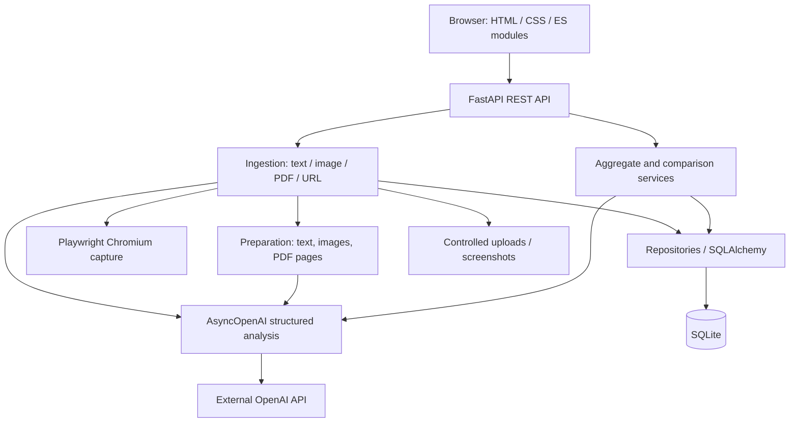

# Architecture

PEM08 v2 — локальное Web-приложение: browser UI, FastAPI backend, SQLite и filesystem artifacts. Frontend использует ES modules без build pipeline. API contracts и structured AI schemas определены Pydantic; business logic находится в services, SQLAlchemy persistence — в repositories.

## Компоненты

Chromium работает локально и обращается к публичному URL под URL policy. OpenAI — внешний сервис: ему передаётся подготовленное содержимое источников. Ключ читается только backend из local environment / `.env`.

## Source, Snapshot, Analysis

| Entity | Значение |
|---|---|
| Competitor | Название, сайт, ниша и заметки компании |
| Source | Зарегистрированный материал: text, image, PDF или URL |
| Snapshot | Сохранённая версия source: содержимое, capture metadata и ссылки на принадлежащие ей артефакты |
| Analysis | Сохранённый структурированный результат; source analysis связан со snapshot, aggregate — с competitor |
| Comparison | Сохранённый результат сопоставления 2–5 aggregate-профилей |

Добавление source сохраняет подготовленный snapshot и запускает AI-анализ. Если AI недоступен, уже сохранённый материал остаётся для retry. «Повторить анализ» использует текущий snapshot; URL «Обновить страницу» выполняет новый capture и сохраняет новый snapshot. Исторические snapshots и analyses сохраняются.

Aggregate берёт только последний analysis последнего snapshot каждого source. Исторический analysis предыдущей версии не подставляется вместо отсутствующего текущего результата. Если usable current analyses нет, операция возвращает контролируемую ошибку без AI-вызова. Comparison использует последние сохранённые aggregates и не создаёт их скрыто.

## Границы ответственности

- `backend/api/`: validation, HTTP statuses, error envelopes и orchestration входящих запросов.
- `backend/services/`: ingestion, PDF/image preparation, browser capture, structured AI, aggregate/comparison и artifact ownership.
- `backend/repositories/`: операции над persisted entities; SQLite через SQLAlchemy.
- `backend/security/`: проверка URL, адресов и DNS resolution для SSRF policy.
- `frontend/js/api.js`: единая fetch boundary, JSON/error handling и 204 responses.
- Остальные frontend modules: state, workspace, source preview, analysis и comparison; version checks защищают UI от stale responses.

## Persistence и safety

SQLite и каталоги uploads/screenshots находятся по конфигурируемым локальным путям. Preview выдаёт только DB-owned UUID artifacts через source/snapshot route; клиент не выбирает произвольный filesystem path. Original uploads и captures исключены из Git. Для backup остановите приложение и сохраните DB вместе с обоими каталогами.

Проверки ограничивают upload types/sizes, PDF pages/text, URL schemes/addresses и redirects/subrequests. UI создаёт plain-text DOM; модель не может вставить executable HTML. Default binding — loopback, auth отсутствует. Это архитектура для локального доверенного пользователя; открытый Internet deployment требует отдельного доступа и egress controls.

API routes: [quick reference](../docs.md). Setup и limitations: [README](../README.md).
